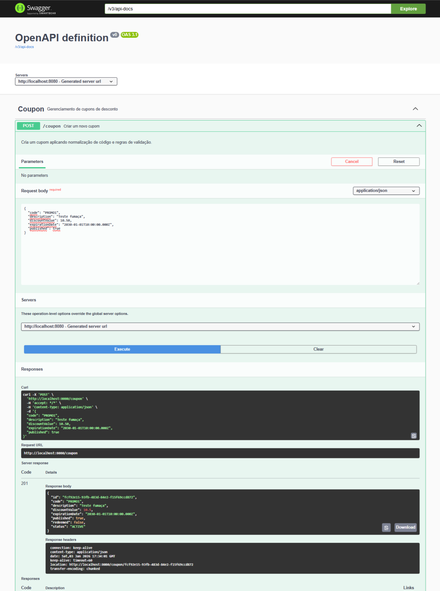
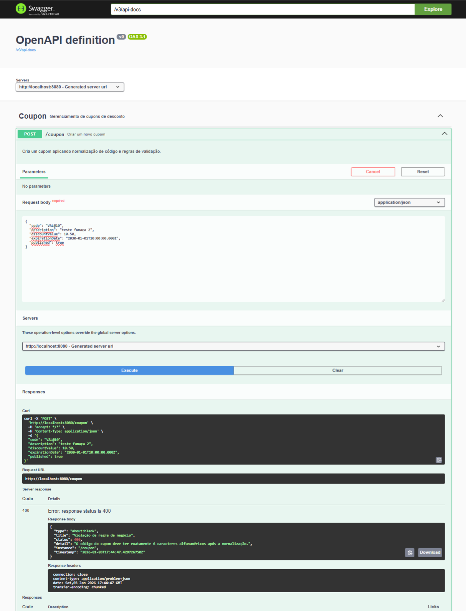

# Desafio técnico (Projeto Tenda) - Coupon API

## Observação inicial

Resolvi implementar o desafio seguindo os requisitos de nível Pleno, mesmo que a vaga contemple o nível Júnior. Quis aproveitar para demonstrar o que já sei fazer em projetos mais complexos, inclusive, que mantenho hoje em produção.

## 1. Tech Stack

- **Java 17**;
- **Spring Boot 3.5.9**
    - *Spring Web*
    - *Spring Data JPA*
    - *Bean Validation*
- **H2 Database**
- **Lombok**;
- **SpringDoc OpenAPI (Swagger)**;
- **Docker e Docker Compose**;
- **JUnit 5**;
- **Mockito**;
- **JaCoCo**.

## 2. Decisões técnicas e de arquitetura

Tomei algumas decisões técnicas que vale documentar. De cara, implementei arquitetura em camadas (Controller, Service, Repository) para manter as responsabilidades bem separadas. Abaixo, outras decisões importantes:

- **2.1** - Desacoplei a entidade JPA (`Coupon`) dos DTOs para não expor detalhes internos do banco de dados diretamente na API, facilitando a evolução do projeto futuramente e seguindo as boas práticas de separação de responsabilidades.
- **2.2** - Implementei os DTOs com `Records` (Java 14+), que garantem imutabilidade e deixam o código mais limpo e conciso.
- **2.3** - Evitei `@Autowired` em atributos e usei `@RequiredArgsConstructor` do Lombok para injeção via construtor, o que mantém os componentes imutáveis e facilita os testes unitários.

Seguindo a recomendação de rigor no contrato da API, antecipei as validações:

- **2.4** - Campos como data de expiração (`@Future`) e valor de desconto (`@DecimalMin`) já são validados na chegada da requisição.
- **2.5** - Para garantir o formato exato exigido (milissegundos e timezone UTC), configurei `@JsonFormat` com padrão ISO-8601, mantendo o contrato coerente com os requisitos.

Decidi manter as regras de negócio separadas na camada service, então:

- **2.6** - Implementei o método `normalizarCodigo` com Regex, garantindo que apenas caracteres alfanuméricos sejam persistidos, independente da sujeira enviada no input.
- **2.7** - Para o soft delete, implementei deleção lógica ao invés de remoção física, apenas marcando o cupom como `DELETED` e preenchendo o timestamp `deletedAt`, preservando o histórico dos dados.
- **2.8** - Criei a `BusinessException` para centralizar erros de regra de negócio (ex: cupom já deletado), evitando que exceções genéricas (500) ou de infraestrutura vazem para o cliente final.

E, sobre o tratamento de erros e Swagger:

- **2.9** - Implementei um `GlobalExceptionHandler` com `ProblemDetail` (nativo do Spring Boot 3) para padronizar as respostas de erro seguindo a RFC 7807.
- **2.10** - Utilizei anotações do Swagger (`@Operation`, `@ApiResponse`) na Controller para que a documentação reflita exatamente o comportamento dos códigos HTTP (201, 204, 400, 404), facilitando o consumo da API.


*(Interface do Swagger UI demonstrando os endpoints documentados)*

Abaixo, apresento dois cenários que validam a solução:

**Sucesso na criação:** 


*(Requisição com código válido e retorno formatado em ISO-8601 UTC)*

**Falha na criação por código inválido após a limpeza:**


*(O código VAL@10 possui 6 caracteres, mas após a remoção do @ pela aplicação, ele resulta em apenas 5. A API identifica que o dado não atende aos requisitos e retorna um erro 400 padronizado - RFC 7807)*

## 3. Estratégia de testes e qualidade

Implementei uma estratégia de testes que cobre tanto a lógica de negócio isolada quanto o cumprimento do contrato da API:

### 3.1 Testes unitários 
Concentrei na classe `CouponService`, onde reside a maior parte das regras de negócio. Utilizei o **Mockito** para isolar as dependências (como Repository e Mapper). Aqui, garanti o funcionamento de cenários como a normalização de códigos via Regex e o lançamento correto das `BusinessExceptions`.

### 3.2 Testes de integração
Utilizei **MockMvc** com o contexto do Spring carregado (`@SpringBootTest`). Para validar o fluxo de ponta a ponta, foi utilizado o banco em memória (**H2**). Nesse teste foram feitas:
- A verificação da serialização e desserialização dos JSONs.
- A validação automática dos DTOs.
- A conferência dos HTTP Status Codes (201, 204, 400) e da persistência real dos dados no banco.

### 3.3 JaCoCo
Por fim, configurei o plugin **JaCoCo** para validar a cobertura de testes. O relatório final aponta uma cobertura superior a **85%** nas classes principais, superando o requisito inicial de 80%, conforme o print abaixo. 


*(Relatório de cobertura de código gerado pelo JaCoCo)*

## 4. O que eu faria diferente com mais tempo
Algumas decisões priorizaram a simplicidade de execução local (como o uso do H2). Em um ambiente de produção e com mais tempo, eu evoluiria os seguintes pontos:

1. Migraria o banco H2 (em memória) para um banco como **PostgreSQL** rodando via Docker Compose;
2. Implementaria **Spring Security** com tokens JWT (OAuth2) para proteger os endpoints da API.
3.  Adotaria ferramentas como **Flyway** ou **Liquibase** para versionamento do esquema do banco de dados, ao invés de deixar o Hibernate criar as tabelas automaticamente.
4.  Criaria pipelines CI/CD (ex: GitHub Actions) para automatizar o build, a execução dos testes e a verificação de qualidade (SonarQube) a cada novo commit, push na main, etc.
5.  Adicionaria **Spring Boot Actuator** integrado ao Prometheus/Grafana para observabilidade e monitoramento de métricas em tempo real.

## 5. Como executar a aplicação

### Opção A: Via Docker
Para rodar a aplicação pronta para uso, sem necessidade de instalar o Java:
```bash
docker-compose up --build
```

### Opção B: Via Maven (Local)
Caso queira rodar diretamente na sua IDE ou terminal:

1. Clone o repositório.
2. Na raiz do projeto, execute:

```bash
./mvnw spring-boot:run
```
 
**Após subir a aplicação, acesse:**

- **API Base:** http://localhost:8080
- **Documentação (Swagger):** http://localhost:8080/swagger-ui.html
- **Console H2:** http://localhost:8080/h2-console

## 6. Como executar os testes

Para validar a qualidade do código e gerar os relatórios de cobertura:

### 6.1 Rodar todos os testes
No terminal, execute:

```bash
./mvnw clean test
```

### 6.2 Gerar Relatório de Cobertura (JaCoCo)
Para gerar o site com as métricas:

```bash
./mvnw clean verify jacoco:report
```

Após o comando, abra o arquivo abaixo no navegador:

```
target/site/jacoco/index.html
```


