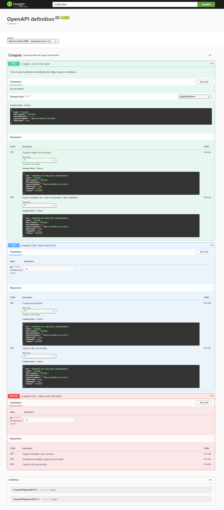
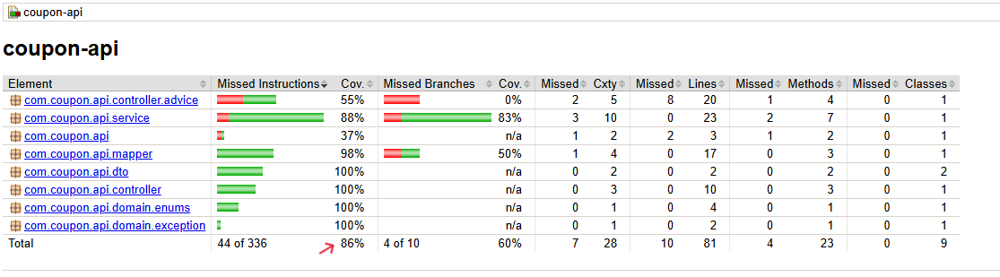

# Desafio técnico (Projeto Tenda) - Coupon API

## Observação inicial

Embora a proposta original deste desafio técnico contemple requisitos para o nível Júnior, optei por desenvolvê-lo mirando a régua mais alta (**nível Pleno**).

Tomei essa decisão para demonstrar que, independente do nível da vaga, possuo bagagem técnica compatível com desafios de maior complexidade. Essa capacidade é sustentada pela minha experiência prática com projetos de complexidade superior (arquiteturas distribuídas/microsserviços) e que mantenho atualmente em produção.

## 1. Tech Stack

- **Java 17**;
- **Spring Boot 3.5.9**
    - *Spring Web*
    - *Spring Data JPA*
    - *Bean Validation*
- **H2 Database**
- **Lombok**;
- **SpringDoc OpenAPI (Swagger)**;
- **Docker e Docker Compose**;
- **JUnit 5**;
- **Mockito**;
- **JaCoCo**.

## 2. Decisões técnicas e de arquitetura

Durante o desenvolvimento, fui tomando algumas decisões técnicas que considerei importante documentar. De cara, em relação à arquitetura do desafio, optei por implementar em camadas (Controller, Service, Repository), para que cada peça do projeto tenha responsabilidades bem definidas. Abaixo, cito mais algumas decisões importantes:

- **2.1** - Mesmo sendo de praxe, ressalto que utilizei a estratégia de desacoplar a entidade JPA (`Coupon`) dos (`DTOs`), para evitar a exposição de detalhes internos do banco de dados e para que API evolua obedecendo as melhores práticas.
- **2.2** - Os DTOs foram implementados utilizando `Records` (do Java 14+), que, por sua vez, garante imutabilidade, código muito mais conciso e legível para o transporte dos dados.
- **2.3** - Evitei o uso de `@Autowired` diretamente nos atributos. Sendo assim, utilizei a anotação `@RequiredArgsConstructor` do Lombok para realizar a injeção de dependência via construtor, seguindo as boas práticas. Isso favorece a imutabilidade dos componentes, além de facilitar a escrita de testes unitários sem a necessidade de mocks complexos ou contêineres Spring.

Seguindo a recomendação de rigor no contrato da API, antecipei as validações:

- **2.4** - Campos como data de expiração (`@Future`) e valor de desconto (`@DecimalMin`) já são validados na chegada da requisição.
- **2.5** - Para garantir que a aplicação se comunique exatamente no formato exigido (com milissegundos e fuso horário Z), forcei o padrão ISO via `@JsonFormat`. Dessa forma, assegurei que fica coerente com a especificação do desafio.

Decidi manter as regras de negócio separadas na camada service, então:

- **2.6** - Implementei o método `normalizarCodigo` com Regex, garantindo que apenas caracteres alfanuméricos sejam persistidos, independente da sujeira enviada no input.
- **2.7** - Para viabilizar o soft delete, implementei a estratégia da deleção lógica ao invés da remoção física dos registros, apenas marcando o cupom como `DELETED` e preenchendo o timestamp `deletedAt`. Isso preserva o histórico dos dados.
- **2.8** - Criei a `BusinessException` para centralizar erros de regra de negócio (ex: cupom já deletado). Isso evita o vazamento de exceções genéricas (500) ou de infraestrutura para o cliente final.

E, sobre o tratamento de erros e Swagger:

- **2.9** - Implementei um `GlobalExceptionHandler` utilizando o `ProblemDetail` (nativo do Spring Boot 3). Isso foi feito com o intuito de padronizar as respostas de erro da API RESTful, seguindo a especificação RFC 7807.
- **2.10** - Utilizei anotações do Swagger (`@Operation`, `@ApiResponse`) na Controller para que a documentação reflita exatamente o comportamento dos códigos HTTP (201, 204, 400, 404), facilitando o consumo da API.


*(Interface do Swagger UI demonstrando os endpoints documentados)*

## 3. Estratégia de testes e qualidade

A qualidade do projeto ficou garantida pela alta cobertura de testes, cobrindo tanto a lógica de negócio isolada quanto o cumprimento do contrato da API. Dessa forma, temos aqui:

### 3.1 Testes unitários 
Concentrei na classe `CouponService`, onde reside a maior parte das regras de negócio. Utilizei o **Mockito** para isolar as dependências (como Repository e Mapper). Aqui, garanti o funcionamento de cenários como a normalização de códigos via Regex e o lançamento correto das `BusinessExceptions`.

### 3.2 Testes de integração
Utilizei **MockMvc** com o contexto do Spring carregado (`@SpringBootTest`). Para validar o fluxo de ponta a ponta, foi utilizado o banco em memória (**H2**). Nesse teste foram feitas:
- A verificação da serialização e desserialização dos JSONs.
- A validação automática dos DTOs.
- A conferência dos HTTP Status Codes (201, 204, 400) e da persistência real dos dados no banco.

### 3.3 JaCoCo
Por fim, configurei o plugin **JaCoCo** para validar a cobertura de testes. O relatório final aponta uma cobertura superior a **85%** nas classes principais, superando o requisito inicial de 80%, conforme o print abaixo. 


*(Relatório de cobertura de código gerado pelo JaCoCo)*

## 4. O que eu faria diferente com mais tempo
Dado o escopo do desafio, algumas decisões priorizaram a simplicidade de execução local (como o uso do H2). Num cenário produtivo real e com mais tempo, eu evoluiria os seguintes pontos:

1. Migraria o banco H2 (em memória) para um banco como **PostgreSQL** rodando via Docker Compose;
2. Implementaria **Spring Security** com tokens JWT (OAuth2) para proteger os endpoints da API.
3.  Adotaria ferramentas como **Flyway** ou **Liquibase** para versionamento do esquema do banco de dados, ao invés de deixar o Hibernate criar as tabelas automaticamente.
4.  Criaria pipelines CI/CD (ex: GitHub Actions) para automatizar o build, a execução dos testes e a verificação de qualidade (SonarQube) a cada novo commit, push na main, etc.
5.  Para viabilizar a Observabilidade, adicionaria o **Spring Boot Actuator** integrado ao Prometheus/Grafana para monitoramento de métricas da aplicação em tempo real.

## 5. Como executar a aplicação

### Opção A: Via Docker
Para rodar a aplicação pronta para uso, sem necessidade de instalar o Java:
```bash
docker-compose up --build
```

### Opção B: Via Maven (Local)
Caso queira rodar diretamente na sua IDE ou terminal:

1. Clone o repositório.
2. Na raiz do projeto, execute:

```bash
./mvnw spring-boot:run
```
 
**Após subir a aplicação, acesse:**

- **API Base:** http://localhost:8080
- **Documentação (Swagger):** http://localhost:8080/swagger-ui.html
- **Console H2:** http://localhost:8080/h2-console

## 6. Como executar os testes

Para validar a qualidade do código e gerar os relatórios de cobertura:

### 6.1 Rodar todos os testes
No terminal, execute:

```bash
./mvnw clean test
```

### 6.2 Gerar Relatório de Cobertura (JaCoCo)
Para gerar o site com as métricas:

```bash
./mvnw clean verify jacoco:report
```

Após o comando, abra o arquivo abaixo no navegador:

```
target/site/jacoco/index.html
```


